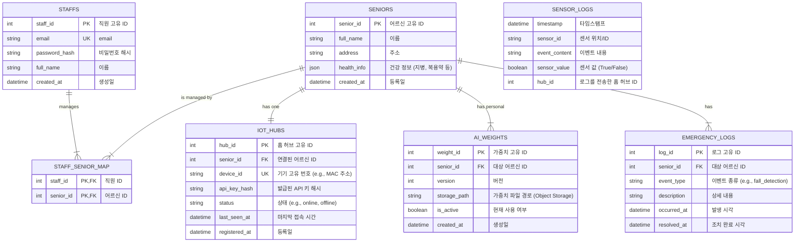

# 백엔드 기능 명세

상태: 진행 중
프로젝트: PJT 2 (https://www.notion.so/PJT-2-259cce47468a80ce83f6c643676c850f?pvs=21)

## 아키텍처

### 시스템 아키텍처

- 아키텍처 설계 의도
    - 메세지 큐를 통해 AI 추론시 이상치 검출되면 즉시 백엔드에게 빠르게 알림
    - redis를 통해 빠른 가중치 로딩을 구현하여 여러 어르신의 가중치를 하나의 머신에서 동시에 실행시킬 수 있음
    - DB의 CUD는 백엔드만 담당하고 AI서버에서는 R만 할 수 있게하여 데이터를 사용하는 입장에서는 백엔드를 거치지 않고 데이터를 빠르게 접근 가능하고 백엔드는 데이터를 일관적으로 관리할 수 있음
    - WebSocket을 통해 실제 클라이언트의 반응도 서버가 확인하여 응급 알림이 제대로 확인 되었는 지, 안전 로봇이 안전 확인 요청을 잘 받았는 지 확인

### WebRTC 기반 스트리밍 흐름도

### 가중치 로딩

## ERD

## api 명세 기획

### 인증

1. 직원 로그인 기능
2. 노인 및 기기 등록
3. api 키 발급
4. 기기 등록 해지

### 사용자 관리 및 모니터링

1. 사용자 리스트 조회
2. 사용자 세부 정보 조회
3. 사용자 응급 상황 로그 조회

### IoT

1. 센서 이벤트 로그 전송
2. 어르신 안전 확인

### AI

1. 가중치 경로 조회
2. 가중치 등록 신청