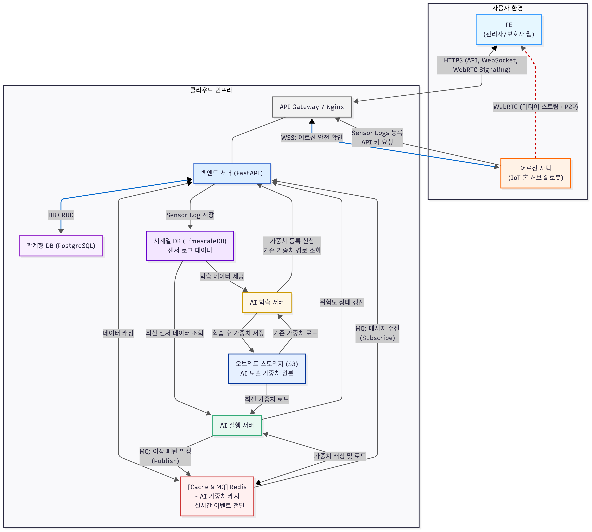
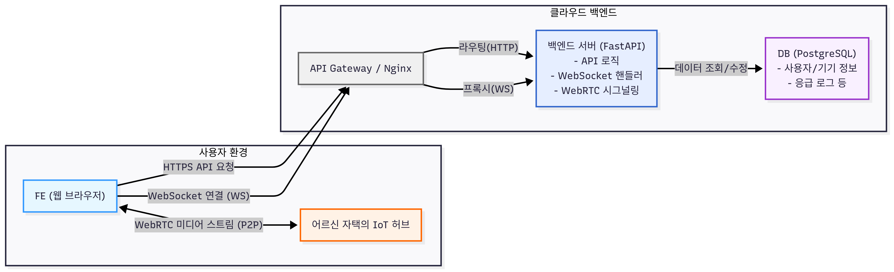
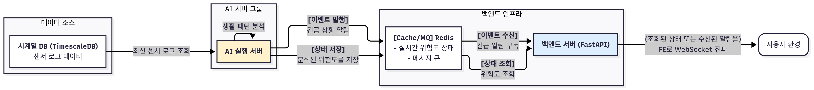
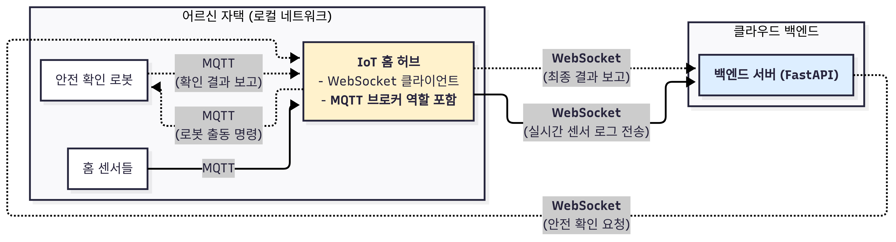

## **백엔드 개요**

### **서비스 소개**

- **목표:** IoT 센서와 AI를 활용하여 독거 어르신의 일상 활동을 비침습적으로 학습하고, 이상 패턴 감지 시 보호자 및 관리자에게 신속하게 알림과 실시간 현장 상황을 제공하는 지능형 모니터링 시스템.
- **핵심 기능:**
    - 홈 IoT 센서 로그 기반 실시간 생활 패턴 분석.
    - 개인화된 AI 모델을 통한 이상 징후 및 응급 상황(낙상 등) 감지.
    - WebSocket 기반 실시간 대시보드 및 긴급 상황 알림.
    - WebRTC를 활용한 초저지연 현장 영상 스트리밍.
    - 안전 확인 로봇 원격 제어 및 상태 보고.

### **주요 기술 스택**

- **Application:** FastAPI (Python)
- **Database:**
    - PostgreSQL (Relational DB)
    - TimescaleDB (Time-series DB)
    - Redis (In-Memory Cache & Message Queue)
- **Real-time Communication:**
    - Socket.IO (WebSocket)
    - WebRTC
- **Infrastructure:**
    - Docker
    - Nginx
- **Data Storage:**
    - AWS S3 (Object Storage)

## 백엔드 아키텍처 소개

### 전체 아키텍처



- **비동기 프레임워크 (FastAPI) 채택**
    - 수많은 IoT 기기와의 동시 연결 및 실시간 통신(WebSocket)을 효율적으로 처리하기 위해 비동기 I/O 모델을 채택.
    - Python 기반으로 AI 서버 그룹과의 높은 통합성과 개발 생산성을 확보.
- **목적별 데이터 저장소 분리**
    - 정형 데이터(사용자 정보 등)는 **PostgreSQL**, 대용량 시계열 데이터(센서 로그)는 **TimescaleDB**에 저장하여 각 데이터 유형에 최적화된 성능을 보장.
    - 휘발성/캐시 데이터(AI 가중치, 실시간 상태)와 메시지 큐는 **Redis**를 활용하여 시스템 전반의 응답 속도와 안정성을 향상.
- **마이크로서비스 아키텍처 도입**
    - `백엔드 서버`, `AI 실행 서버`, `AI 학습 서버`를 분리하여 각 컴포넌트의 독립적인 확장과 개발을 가능하게 함.
    - AI의 높은 연산 부하가 사용자 API 응답 속도에 영향을 주지 않도록 시스템을 격리.
- **실시간 통신 기술의 전략적 선택**
    - **WebSocket(Socket.IO):** 상태/알림 등 저용량 메시지를 실시간으로 양방향 교환하기 위해 채택.
    - **WebRTC:** 서버 부하와 비용을 최소화하면서 초저지연 영상 스트리밍을 구현하기 위해 P2P 방식을 채택.
    - **Redis Pub/Sub:** AI 서버와 백엔드 서버 간의 통신을 분리(Decoupling)하여, 한쪽 서버의 장애가 다른 서버의 긴급 알림 처리 기능에 영향을 주지 않도록 설계.

### FE-BE 구조



1. **api 제공을 통한 서비스**
    1. 직원 인증 기능 제공
    2. 담당 어르신 관리 기능 제공
2. **웹소켓을 통한 서비스**
    1. 어르신 위험 알림 제공
    2. 어르신 홈센서 모니터링 서비스 제공
3. **WebRTC를 통한 서비스**
    1. 응급 현장 스트리밍 서비스 제공

### AI-BE 구조



1. **센서 로그 기반 위험도 추론**
    
    시계열 DB에서 실시간으로 조회한 센서 로그를 기반으로 위험도를 추론
    
2. **어르신 위험 감지**
    
    하드룰과 추론 결과를 바탕으로 위험을 감지하고 메세지 큐를 통해 실시간으로 알림
    

### HUB-BE 구조



Iot 허브를 통해 센서 로그를 수신받고 로봇과 통신

## 포팅 메뉴얼

1. **실행 환경**
    
    ```
    │  .env                      # docker compose 실행에 필요한 환경변수
    │  docker-compose.yml        # 도커 컨테이너 실행 및 관리를 위한 docker compose 파일
    │
    ├─docker                 
    │  ├─secure
    │  │      .env               # 백엔드 실행에 필요한 환경변수
    │  │
    │  ├─signaling
    │  │  └─certs
    │  └─turn                    # webrtc turn서버 실행에 필요한 파일
    │      ├─certs
    │      │      fullchain.pem
    │      │      privkey.pem
    │      │
    │      └─turnserver.conf
    └─proxy                      # nginx 설정 관련
            nginx.conf    
    ```
    
2. **docker compose 세팅**
    
    ```
    volumes:
      swagger-docs:
      postgres_data:
      redis_data:
      coturn_data:
    
    networks:
      sst-network:
        driver: bridge
    
    services:
      proxy:
        image: nginx:latest
        container_name: nginx_proxy
        ports:
          - "80:80"
          - "443:443"
        volumes:
          - ${BASE_DIR}/proxy/nginx.conf:/etc/nginx/conf.d/default.conf
          - /etc/letsencrypt:/etc/letsencrypt:ro
        networks:
          - sst-network
        restart: unless-stopped
    
      sst-web:
        image: j13a503.p.ssafy.io:5000/sst_web:latest
        container_name: sst_web
        env_file:
          - ${BASE_DIR}/docker/secure/.env
        networks:
          - sst-network
        restart: unless-stopped
    
      postgres:
        image: timescale/timescaledb:latest-pg15
        container_name: project_db
        restart: unless-stopped
        environment:
          - POSTGRES_USER=${DB_ROOT_USER}
          - POSTGRES_PASSWORD=${DB_ROOT_PW}
          - POSTGRES_DB=${DB_NAME}
        ports:
          - "${POSTGRES_PORT}:${POSTGRES_PORT}"
        volumes:
          - postgres_data:/var/lib/postgresql/data
        networks:
          - sst-network
    
      redis:
        image: redis:7-alpine
        container_name: project_redis
        restart: unless-stopped
        ports:
          - "${REDIS_PORT}:${REDIS_PORT}"
        command: >
          redis-server 
          --appendonly yes 
          --requirepass ${REDIS_PASSWORD}
        volumes:
          - redis_data:/data
        networks:
          - sst-network
    
      turn-server:
        image: coturn/coturn
        container_name: rtc_turn
        restart: unless-stopped
        networks:
          - sst-network
        volumes:
          - ${BASE_DIR}/docker/turn/turnserver.conf:/etc/coturn/turnserver.conf:ro
          - ${BASE_DIR}/docker/turn/certs:/etc/turn/certs:ro
          - coturn_data:/var/lib/turn
        ports:
          - '3478:3478/udp'
          - '3478:3478/tcp'
          - '5349:5349/udp'
          - '5349:5349/tcp'
          - '49152-49200:49152-49200/udp'
        command:
          - "turnserver"
          - "--realm=j13a503.p.ssafy.io"
          - "--fingerprint"
          - "--listening-ip=0.0.0.0"
          - "--external-ip=43.201.149.57"
          - "--listening-port=3478"
          - "--tls-listening-port=5349"
          - "--min-port=49152"
          - "--max-port=65535"
          - "--log-file=stdout"
          - "--verbose"
          - "--user=${TURN_ID}:${TURN_PW}"
          - "--lt-cred-mech"
          - "--cert=/etc/turn/certs/fullchain.pem"
          - "--pkey=/etc/turn/certs/privkey.pem"
          
    ```
    
3. **백엔드 컨테이너 빌드**
    
    dockerfile.web을 통해 빌드
    
    ⇒ 빌드 시 프론트 폴더도 필요
    
4. **api 명세서**
    
    BackEnd의 sst_api.yml 참고