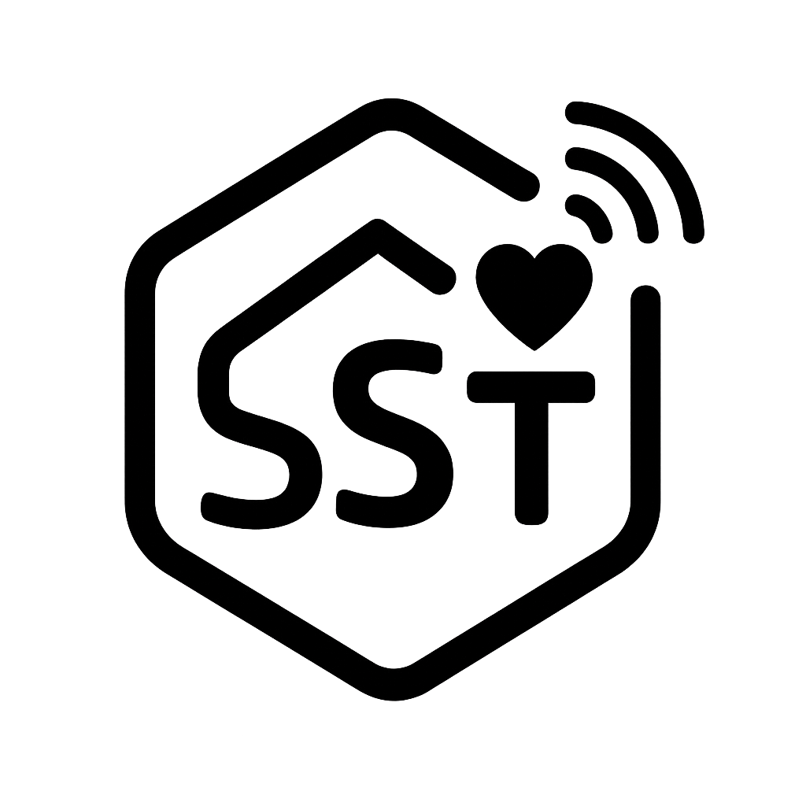

# 🏠 SST 어르신 케어 시스템

<div align="center">



**스마트 홈 기반 어르신 케어 모니터링 시스템**

[](https://reactjs.org/)
[](https://www.typescriptlang.org/)
[](https://vitejs.dev/)
[](https://socket.io/)

</div>

---

## 📋 프로젝트 소개

**SST 어르신 케어 시스템**은 React + TypeScript 기반의 모바일 웹 애플리케이션으로, 어르신의 실시간 모니터링과 보호자 연락 기능을 제공합니다.

### 🎯 주요 기능

- 🏠 **어르신 목록 관리** - 등록된 어르신들의 정보 조회 및 관리
- 📹 **실시간 영상 스트리밍** - WebRTC를 통한 실시간 모니터링
- 🔔 **실시간 알림 시스템** - Socket.IO 기반 즉시 알림
- 📱 **모바일 최적화** - 터치 친화적 반응형 UI/UX
- 🔐 **보안 인증** - JWT 기반 사용자 인증 시스템
- 📊 **센서 데이터 모니터링** - IoT 센서 데이터 실시간 확인

---

## 🛠️ 기술 스택

### Frontend
- **React 19.1.1** - 사용자 인터페이스 구축
- **TypeScript 5.8.3** - 타입 안전성 보장
- **Vite 7.1.2** - 빠른 개발 환경 및 빌드
- **React Router DOM 7.8.2** - 클라이언트 사이드 라우팅
- **Tailwind CSS 4.1.13** - 유틸리티 우선 CSS 프레임워크
- **Socket.IO Client 4.8.1** - 실시간 양방향 통신
- **Lucide React 0.543.0** - 아이콘 라이브러리

### 개발 도구
- **ESLint 9.33.0** - 코드 품질 관리
- **PostCSS 8.5.6** - CSS 후처리
- **Autoprefixer 10.4.21** - CSS 벤더 프리픽스 자동 추가

---

## 🚀 빠른 시작

### 1. 필수 요구사항
- **Node.js** 18.0.0 이상
- **npm** 9.0.0 이상

### 2. 프로젝트 설치
```bash
# 저장소 클론
git clone https://lab.ssafy.com/s13-mobility-smarthome-sub1/S13P21A503.git
cd FrontEnd

# 의존성 설치
npm install
```

### 3. 개발 서버 실행
```bash
# 개발 서버 시작 (포트: 5175)
npm run dev
```

### 4. 브라우저에서 확인
```
http://localhost:5175
```

---

## 📁 프로젝트 구조

```
src/
├── api/                    # API 관련
│   ├── eldersApi.ts       # 어르신 관련 API 함수
│   └── types.ts           # API 타입 정의
├── components/            # 재사용 가능한 컴포넌트
│   ├── common/           # 공통 컴포넌트
│   │   ├── AddressSearch.tsx
│   │   ├── DatePicker.tsx
│   │   └── SSTLogo.tsx
│   ├── elder/            # 어르신 관련 컴포넌트
│   │   └── ElderCard.tsx
│   ├── layout/           # 레이아웃 컴포넌트
│   │   ├── FilterBar.tsx
│   │   ├── Header.tsx
│   │   └── TabBar.tsx
│   ├── notifications/    # 알림 컴포넌트
│   │   └── InAppNotification.tsx
│   └── webrtc/           # WebRTC 관련 컴포넌트
│       └── WebRTCViewer.tsx
├── contexts/             # React Context
│   ├── NotificationContext.tsx  # 알림 상태 관리
│   └── SocketContext.tsx       # WebSocket 연결 관리
├── layouts/             # 페이지 레이아웃
│   └── MobileLayout.tsx
├── pages/               # 페이지 컴포넌트
│   ├── auth/           # 인증 관련 페이지
│   │   ├── LoginPage.tsx
│   │   └── RegisterPage.tsx
│   ├── elders/         # 어르신 관리 페이지
│   │   ├── ElderDetailPage.tsx
│   │   ├── ElderEditPage.tsx
│   │   └── EldersPage.tsx
│   ├── home/           # 홈페이지
│   │   └── HomePage.tsx
│   ├── notifications/  # 알림 페이지
│   │   └── NotificationsPage.tsx
│   ├── settings/      # 설정 페이지
│   │   └── SettingsPage.tsx
│   ├── splash/        # 스플래시 페이지
│   │   └── SplashPage.tsx
│   └── webrtc/        # WebRTC 페이지
│       └── WebRTCViewerPage.tsx
├── router/             # 라우팅 설정
│   └── routes.tsx
├── store/              # 상태 관리
│   └── eldersStore.ts
├── utils/              # 유틸리티 함수
│   └── formatAge.ts
└── main.tsx           # 애플리케이션 진입점
```

---

## 🔧 환경 설정

### API 서버 설정
백엔드 서버와의 연동을 위해 `vite.config.ts`에서 프록시 설정:

```typescript
export default defineConfig({
  server: {
    port: 5175,
    proxy: {
      '/api': {
        target: 'https://j13a503.p.ssafy.io',  // 백엔드 서버 URL
        changeOrigin: true,
        secure: true,
        rewrite: (path) => path.replace(/^\/api/, '/api')
      }
    }
  }
})
```

### WebSocket 서버 설정
실시간 통신을 위해 `src/pages/home/HomePage.tsx`에서 WebSocket 연결:

```typescript
useEffect(() => {
  const token = localStorage.getItem('access_token')
  if (token) {
    connectSocket('https://j13a503.p.ssafy.io', token)
  }
}, [connectSocket])
```

---

## 📱 주요 기능

### 🏠 어르신 관리
- 어르신 목록 조회 및 필터링
- 상세 정보 확인 (주소, 건강정보, 보호자 연락처)
- 프로필 이미지 관리
- 센서 데이터 실시간 모니터링

### 📹 실시간 영상 스트리밍
- WebRTC 기반 실시간 영상 통신
- 고품질 비디오 스트리밍 (1280x720, 30fps)
- 오디오 통신 지원
- 자동 연결 관리

### 🔔 실시간 알림
- Socket.IO 기반 즉시 알림
- 다양한 알림 타입 (성공, 오류, 경고, 정보)
- 자동 사라짐 기능
- 모바일 최적화 알림 UI

### 🔐 보안 인증
- JWT 토큰 기반 인증
- 자동 토큰 갱신
- 보호된 라우트 관리
- 안전한 API 통신

---

## 🚀 빌드 및 배포

### 개발 빌드
```bash
# TypeScript 컴파일 + Vite 빌드
npm run build
```

### 프로덕션 미리보기
```bash
# 빌드 결과 미리보기
npm run preview
```

### 코드 품질 검사
```bash
# ESLint 실행
npm run lint
```

---

## 🔌 API 연동

### 주요 API 엔드포인트
```typescript
// 어르신 관리
GET    /api/seniors                    # 어르신 목록 조회
GET    /api/seniors/{id}              # 어르신 상세 정보
GET    /api/seniors/{id}/profile-image # 프로필 이미지
GET    /api/seniors/{id}/sensors      # 센서 데이터

// 인증
POST   /api/auth/login                # 로그인
POST   /api/auth/register            # 회원가입
```

### WebSocket 이벤트
```typescript
// 연결 이벤트
'connect'        # 서버 연결 성공
'disconnect'     # 서버 연결 끊김
'connect_error'  # 연결 오류

// 알림 이벤트
'notification'   # 실시간 알림 수신

// WebRTC 이벤트
'client:register_offer'  # Offer 등록
'server:new_offer'       # 새 Offer 수신
'client:send_answer'     # Answer 전송
'server:new_answer'      # 새 Answer 수신
```

---

## 🎨 UI/UX 특징

### 모바일 최적화
- **터치 친화적** 인터페이스
- **반응형 디자인** (모바일 우선)
- **직관적인 네비게이션**
- **빠른 로딩 속도**

### 디자인 시스템
- **Tailwind CSS** 기반 스타일링
- **일관된 색상 팔레트**
- **접근성 고려** (WCAG 가이드라인)
- **다크/라이트 모드** 지원 준비

---

## 🐛 문제 해결

### 자주 발생하는 문제

#### 1. CORS 오류
```bash
# 해결방법: vite.config.ts에서 프록시 설정 확인
proxy: {
  '/api': {
    target: 'https://j13a503.p.ssafy.io',
    changeOrigin: true,
    secure: true
  }
}
```

#### 2. WebSocket 연결 실패
```typescript
// 해결방법: 토큰 유효성 및 서버 URL 확인
const token = localStorage.getItem('access_token')
if (token) {
  connectSocket('https://j13a503.p.ssafy.io', token)
}
```

#### 3. TypeScript 빌드 오류
```bash
# 해결방법: 사용하지 않는 import 제거
npm run build
```

#### 4. 이미지 로드 실패 (404)
```typescript
// 해결방법: 프로필 이미지가 없는 경우 기본 이미지 사용
const imageUrl = senior.profile_img || '/default-profile.png'
```

---

## 📊 성능 최적화

### 번들 최적화
- **Vite** 기반 빠른 빌드
- **Tree Shaking** 자동 적용
- **코드 스플리팅** 지원
- **압축된 정적 파일**

### 런타임 최적화
- **React 19** 최신 기능 활용
- **메모이제이션** 최적화
- **지연 로딩** 구현
- **캐싱 전략** 적용

---

## 🤝 기여하기

### 개발 환경 설정
1. 저장소 포크
2. 개발 브랜치 생성
3. 변경사항 커밋
4. Pull Request 생성

### 코딩 컨벤션
- **ESLint** 규칙 준수
- **TypeScript** 타입 안전성
- **컴포넌트 기반** 아키텍처
- **명확한 변수명** 사용

---

## 📞 지원 및 문의

### 개발팀 정보
- **프로젝트명**: SST 어르신 케어 시스템
- **버전**: 0.0.0
- **개발팀**: SSAFY 13기 P21A503
- **저장소**: [GitLab](https://lab.ssafy.com/s13-mobility-smarthome-sub1/S13P21A503)

### 기술 지원
- **Frontend**: React + TypeScript + Vite
- **Backend**: Spring Boot
- **Database**: MySQL/PostgreSQL
- **Infrastructure**: AWS

---

## 📄 라이선스

이 프로젝트는 SSAFY 교육 과정의 일부로 개발되었습니다.

---

## 📝 변경 이력

### v0.0.0 (현재)
- ✅ 기본 프로젝트 구조 설정
- ✅ Socket.IO 통합 및 Context 관리
- ✅ WebRTC 실시간 영상 스트리밍
- ✅ 모바일 최적화 UI/UX
- ✅ JWT 인증 시스템
- ✅ 실시간 알림 시스템

---

<div align="center">

**🎉 SST 어르신 케어 시스템을 사용해주셔서 감사합니다!**

더 자세한 정보는 [포팅 메뉴얼](PORTING_MANUAL.md)을 참고하세요.

</div>