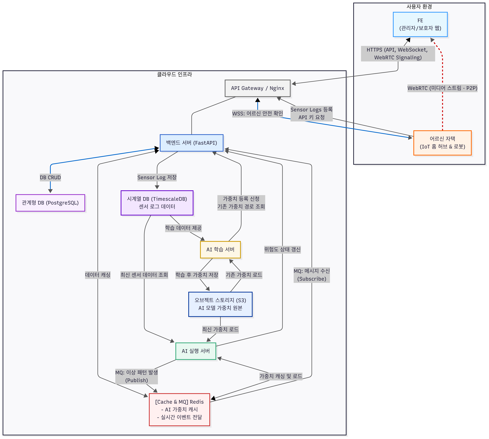
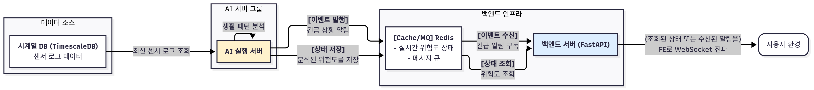
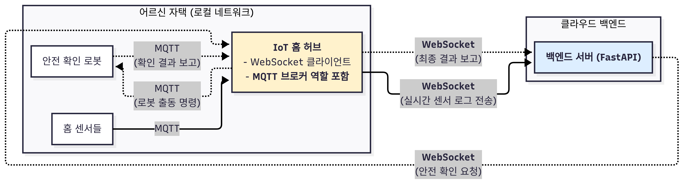

# 🏠 Senior Safe Things (SST)

> 스마트 홈 IoT와 실시간 통신으로 어르신의 일상을 안전하게 연결하는 통합 플랫폼

## 🏟️ 프로젝트 소개
**SST**는 독거 어르신의 안전한 생활을 돕기 위해 **IoT 센서**, **AI 기반 이상 징후 감지**, **실시간 영상 통신**을 통합한 스마트 홈 솔루션입니다.  
단순히 데이터를 수집하는 것을 넘어, **실시간 모니터링**, **위험 상황 알림**, **보호기관 담당자와 보호자의 연결**까지 아우르는 **종합 케어 플랫폼**을 목표로 합니다.  
웹 프론트엔드, 백엔드, AI 추론 서버, 시뮬레이션 모듈로 구성됩니다.

## 👥 팀 구성

### AI (1명)
- **김재희**
    - 룰 기반 + ML 앙상블 추론 파이프라인
    - 위험 래치 정책으로 중복 알림 억제
    - BE 콜백으로 위험도 업데이트

### Backend (1명)
- **정민우**
    - 인증과 권한 관리
    - 어르신 및 센서 리소스 API
    - WebSocket 게이트웨이와 알림 분배
  
### Frontend (1명)
- **황지민**
    - 실시간 대시보드, WebRTC 뷰어, 알림 UX
    - 어르신 관리와 상태별 필터링
    - JWT 기반 인증 플로우

### Simulation (3명)
- **강무엽, 백민재, 이승원**
    - 센서 이벤트(문, 움직임, 조명, 가전 등) 가상 발생
    - 낙상, 무활동, 심야 외출 등 다양한 위험 상황 시나리오 반복 재현
    - 개발 단계에서 실제 하드웨어 없이도 안정적으로 테스트 가능

## 🛠 기술 스택
**AI**  

**Backend**  

**Frontend**  

**Simulation**  

**협업**  

## 💡 서비스 기획 배경

### 목표
혼자 사는 어르신의 **일상 데이터를 비침습적으로 학습**하고, **이상 패턴을 조기 감지**해 가족과 보호자가 신속히 대응할 수 있도록 돕습니다.

### Pain Point
- 기존에 존재하는 시스템은 독거노인의 이상 징후를 늦게 발견
- 센서 데이터가 분산되어 현황 파악이 어려움
- 실시간 확인과 커뮤니케이션 채널 부재

### 차별점
- **실시간 센서 모니터링 + 즉시 알림**
- **WebRTC** 기반 초저지연 현장 확인
- **룰 + ML 앙상블 + 래치 정책**으로 **정확도와 안정성** 동시 확보

## ⭐ 주요 기능

### 실시간 모니터링
- WebSocket으로 센서 상태와 이벤트를 즉시 반영
- 문, 움직임, 조명, TV 등 센서 대시보드
- 상태 변화 시 인앱 알림

### 어르신 관리
- 목록 조회와 상세 정보
- 상태별 필터링 (전체, 위험, 주의, 안전)
- 센서별 최신 상태와 이벤트 히스토리

### 실시간 영상 통신
- WebRTC 기반 현장 스트리밍
- 자동 재연결과 품질 관리
- 보호자 확인 플로우 연동

### 인증과 보안
- JWT 로그인과 자동 갱신
- 보호된 라우트 관리
- HTTPS 통신 필수

## 🏗️ 시스템 구조
### 전체 아키텍처

  

- **비동기 프레임워크 (FastAPI) 채택**
    - 수많은 IoT 기기와의 동시 연결 및 실시간 통신(WebSocket)을 효율적으로 처리하기 위해 비동기 I/O 모델을 채택.
    - Python 기반으로 AI 서버 그룹과의 높은 통합성과 개발 생산성을 확보.
- **목적별 데이터 저장소 분리**
    - 정형 데이터(사용자 정보 등)는 **PostgreSQL**, 대용량 시계열 데이터(센서 로그)는 **TimescaleDB**에 저장하여 각 데이터 유형에 최적화된 성능을 보장.
    - 휘발성/캐시 데이터(AI 가중치, 실시간 상태)와 메시지 큐는 **Redis**를 활용하여 시스템 전반의 응답 속도와 안정성을 향상.
- **마이크로서비스 아키텍처 도입**
    - `백엔드 서버`, `AI 실행 서버`, `AI 학습 서버`를 분리하여 각 컴포넌트의 독립적인 확장과 개발을 가능하게 함.
    - AI의 높은 연산 부하가 사용자 API 응답 속도에 영향을 주지 않도록 시스템을 격리.
- **실시간 통신 기술의 전략적 선택**
    - **WebSocket(Socket.IO):** 상태/알림 등 저용량 메시지를 실시간으로 양방향 교환하기 위해 채택.
    - **WebRTC:** 서버 부하와 비용을 최소화하면서 초저지연 영상 스트리밍을 구현하기 위해 P2P 방식을 채택.
    - **Redis Pub/Sub:** AI 서버와 백엔드 서버 간의 통신을 분리(Decoupling)하여, 한쪽 서버의 장애가 다른 서버의 긴급 알림 처리 기능에 영향을 주지 않도록 설계.

### FE-BE 구조

  

- **api 제공을 통한 서비스**
    - 직원 인증 기능 제공
    - 담당 어르신 관리 기능 제공
- **웹소켓을 통한 서비스**
    - 어르신 위험 알림 제공
    - 어르신 홈센서 모니터링 서비스 제공
- **WebRTC를 통한 서비스**
    - 응급 현장 스트리밍 서비스 제공

### AI-BE 구조

  

- **센서 로그 기반 위험도 추론**
    - 시계열 DB에서 실시간으로 조회한 센서 로그를 기반으로 위험도를 추론
- **어르신 위험 감지**
  - 하드룰과 추론 결과를 바탕으로 위험을 감지하고 메세지 큐를 통해 실시간으로 알림

### HUB-BE 구조

  

- **Iot 허브를 통해 센서 로그를 수신받고 로봇과 통신**

### ERD

  

## 📺 시뮬레이션 GIF
### 자율주행

### 현관문

### 거실 전등

### 냉장고

### TV

## 🔌 인터페이스 요약

### REST API
- GET  /api/seniors  
- GET  /api/seniors/{id}  
- GET  /api/seniors/{id}/profile-image  
- GET  /api/seniors/{id}/sensors  
- POST /api/auth/login  
- POST /api/auth/register  

### WebSocket 이벤트
- client:request_all_senior_status  
- client:request_all_sensor_status  
- server:notify_senior_status_change  
- server:notify_sensor_status_change  
- server:emergency_situation  

### AI 엔드포인트
- POST /ai/tick : 10초 스냅샷 단건 추론  
- POST /ai/infer : 배치 검증 및 백필  
- PUT  /seniors/{id}/risk-level : 추론 결과 반영  
- POST /ai/risk-clear : 래치 해제  

## 🌐 데이터 흐름
1. Unity 시뮬레이션에서 센서 이벤트 발생 (예: 현관문 열림)  
2. C# 스크립트가 이벤트를 캡처 후 MQTT 토픽 발행  
3. Raspberry Pi 허브가 메시지를 Mosquitto 브로커에 전달  
4. Backend → AI 서버에서 이벤트 처리 및 위험도 추론  
5. 결과 알림이 Frontend 대시보드에 반영  
6. Frontend에서 WebRTC로 실시간 시뮬레이션 화면 송출

## 🎨 디자인
**Figma**: [SST 목업](https://www.figma.com/design/Q96zQS7MvwOBUK3yOVAOo4/SST-%EB%AA%A9%EC%97%85?node-id=0-1&p=f&t=nH5OQ2s9bWxoFT7I-0)
* 모바일 우선 반응형
* Tailwind CSS 유틸리티 기반 스타일링

## 📚 문서 목록
| 문서명 | 설명 | 링크 |
|--------|------|------|
| 포팅 매뉴얼 | 포지션 별 포팅 메뉴얼 | [📖 보기](exec) |
| Notion | 싸파트 503호 노션 | [📖 보기](https://www.notion.so/503-2543cc1e521e8077b0d7fc54fcee756a?source=copy_link)|
| 장표 | SST 발표 | [📖 보기](https://www.canva.com/design/DAGz9BrCPRw/nY5FjYlFGx-blBR6XWXRaA/edit)|
---
